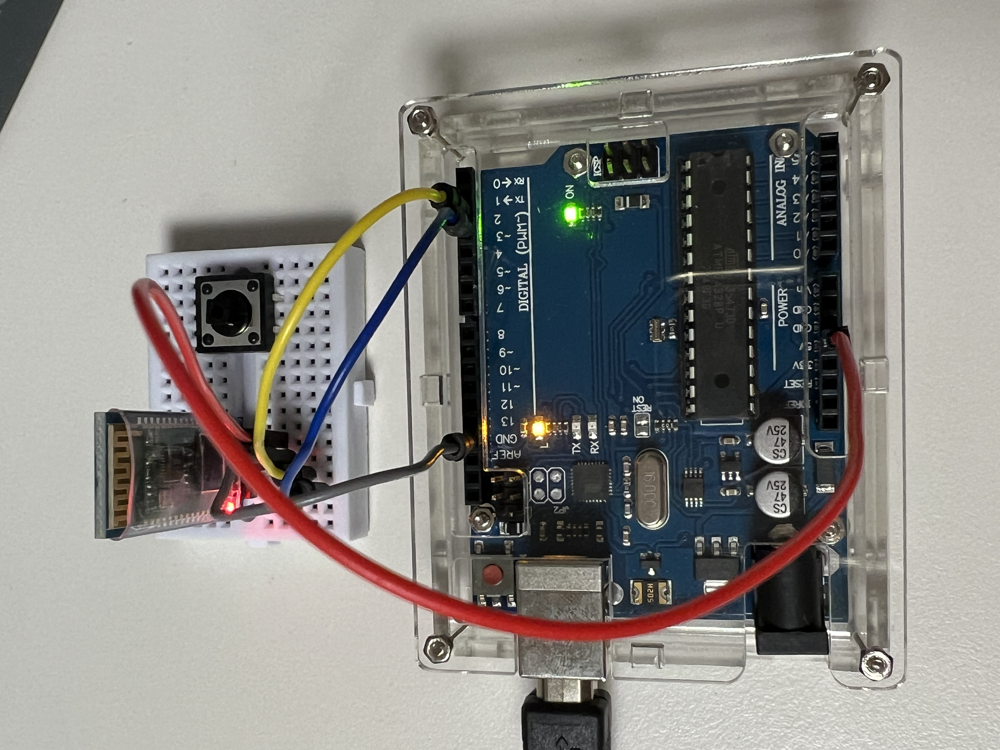
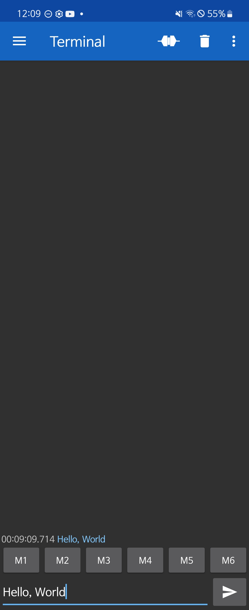
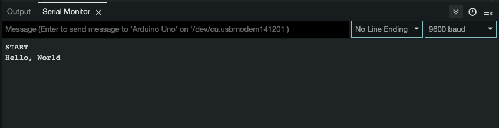

# Bluetooth

## 회로도

블루투스 모듈을 왼쪽부터 차례로 3번핀, 2번핀, GND, 5V에 연결한다. (참고로, 브레드보드 우측의 푸시 버튼은 의미 없음)

블루투스 모듈에 대한 자세한 내용은 [블로그](https://devhoma.tistory.com/173) 참고

## 동작 방법

0. 아두이노 스케치로 [bluetooth_serial_monitor.ino](./bluetooth_serial_monitor.ino) 파일을 업로드한다.

1. 안드로이드 기기에서 블루투스 설정에서 `HC-06`을 찾아 연결한다.
> iOS에서는 해당 모듈로 블루투스 연결을 시도하면 '지원하지 않는 기기'라는 메시지가 뜬다.

> `HC-06`은 이름을 별도로 설정하지 않았을 경우, 기본 값이다. (블루투스 모듈 종류에 따라 다름)

> 연결할 때, Pin(비밀번호)을 별도로 설정한 것이 없으면 기억할 수 있는 숫자로 입력하면 된다. 

2. 플레이 스토어에서 [Serial Bluetooth Terminal](https://play.google.com/store/apps/details?id=de.kai_morich.serial_bluetooth_terminal&pcampaignid=web_share) 앱을 설치한다.

3. 앱을 실행하고 터미널에 아무거나 입력한다.

4. 아두이노 스케치의 시리얼 터미널에서 입력한 내용을 확인할 수 있다.
